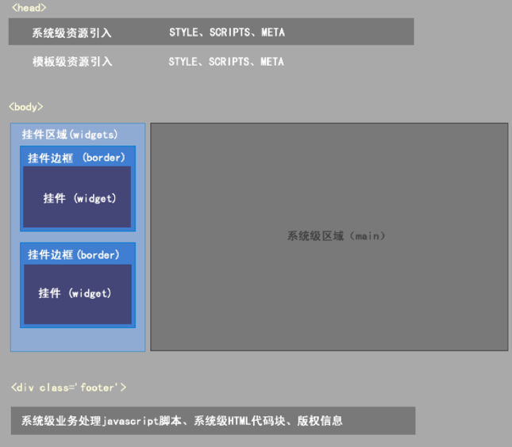
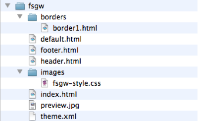
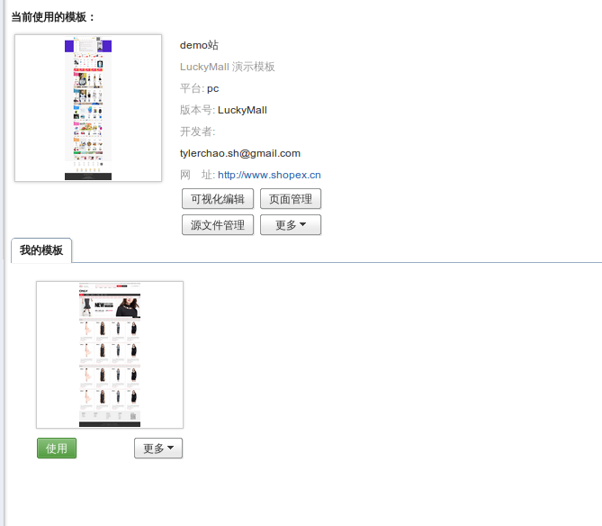
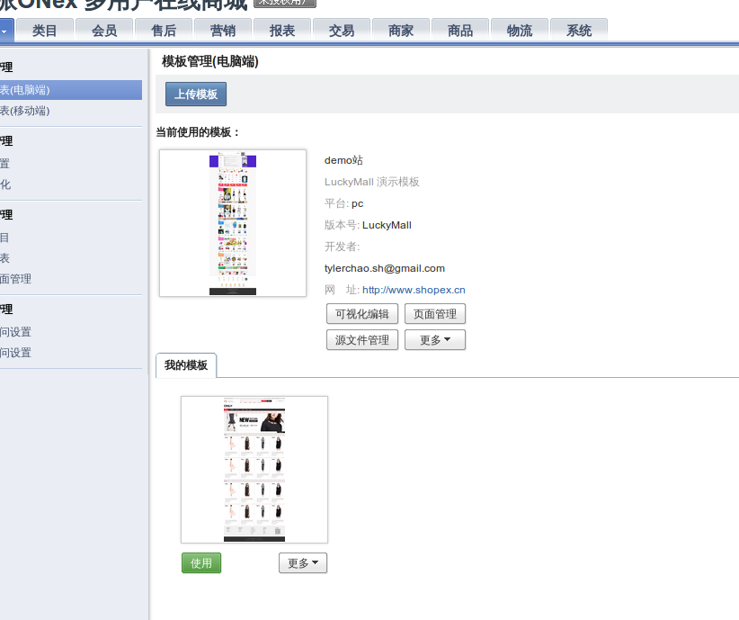
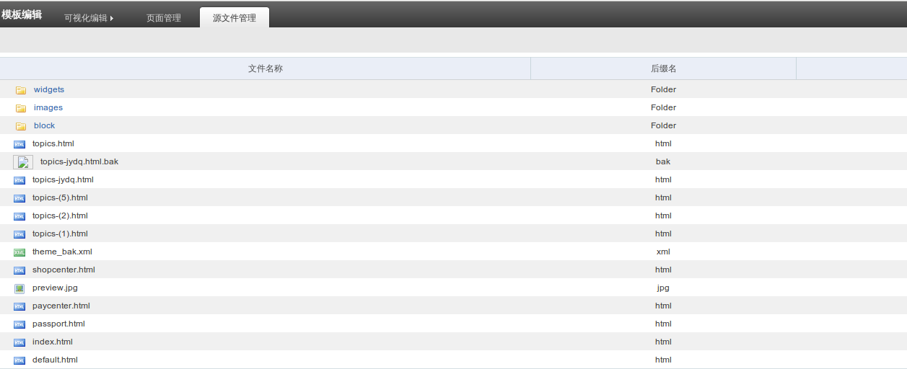
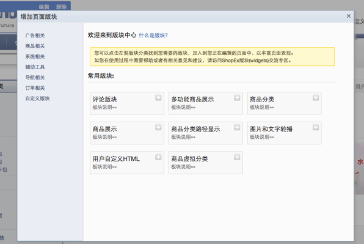
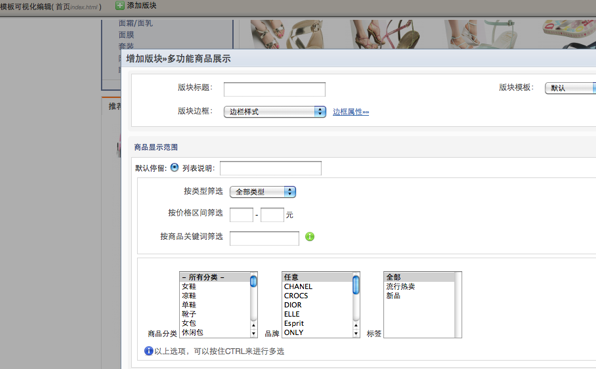
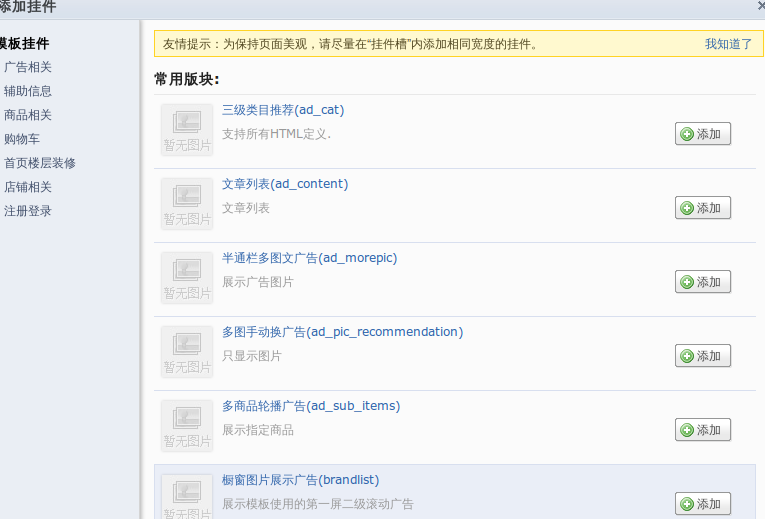
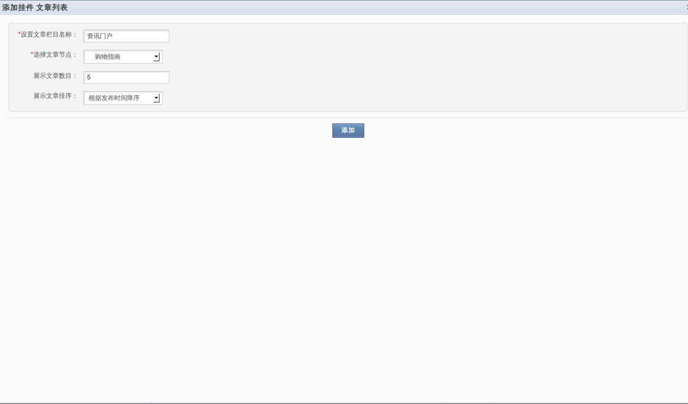
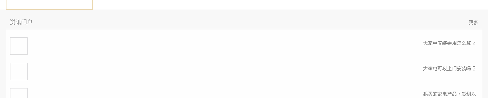

# 模板机制

### ShopEx模板机制的优势

```
1 面对后端开发人员
   模板挂件机制灵活的接口调用让你轻松并且安全的将数据抛向前端,并可方便的构建数据筛选、配置规则和界面。
   模板缓存、自定义URL帮你分担后端开发压力，可能你并不需要关心页面静态化。
2 面对前端开发人员
   默认集成强大的前端开发框架和接口调用。
   严格的要求前端工程师模块化的设计思想。
3 面对网店运营人员
   运营人员无需懂得前端开发技术,可 以在管理后台进行所见即所得的网店的 布局调整,板块数据展示规则设定。
   运营人员可以轻松更换、删减网店板 块,更换挂件板块的内置风格。
   挂件机制可以满足你站外嵌入的需 求。
```

### ShopEx模板机制的创新

```
1 所见既所得的可视化模板板块编辑机制
2 将布局、区块、边框、数据 真正细分化
```

### 模板机制的名词解释


### 挂件区域(widgets)
```
挂件区域用于在某个页面预留挂件(widget)可挂入的区域。也可以理解为“插槽”、“坑”。

每个挂件区域可以挂入多个挂件
```

### 挂件(widget)
```
挂件是ShopEx模板机制中的一个重要角色,它能根据条件从后端取得数据然后根据“挂件级页面模板”来包装成一个小板块。

例如一个“商品板块挂件”,它要先由后端语言(php)来组织数据,然后返回到“挂件级页面模板”。组织数据的条件将会独 立出一个可配置页面。
```

### 边框(border)
```
边框用于包装一个挂件板块,一套模板里面可能由很多个边框风格,这些风格的名称和对应的边框文件 需要定义在模板的描述文件(theme.xml)中,以便可视化编辑时改变一个板块的风格。

例如一个“商品板块挂件”在首页要以三种不同的风格展示(促销、热门、新品......),除了需要在挂件的配置面板中配置数 据的展示范围不同,还需要由边框机制的配合达到颜色风格的区别。特别是一些系统级挂件,为了适应不同模板的展示方 式,默认不会输出标题和边框,边框则可以协助包装一下挂件挂入到挂件区域。
```

### 系统级区域(main)
```
系统级区域用于输出系统的核心交互流程。这些区域的html\javascript是不能在模板包中直接定义的,模板包唯一能影响到这些系统级区域的是 css样式定义,因为模板包的样式表是在系统级样式之后加载。
```

### 默认模板页 (default.html)
```
默认模板页是在模板包中 未定义某个页面的布局时,默认调用的页面布局。例如你的模板包中只包含了两个页面的定义: 首页、默认页,那么其他未定义的页面在访问时将优先使用默认模板页,直到你单独定义它为止。
```



## 创建一个模板包

### 标准模板包必要的文件

创建一个模板包文件夹，例如 test

新模板包文件夹的名称应与描述文件中的 id保持一致，并且应该由数字和英文小写组成。

在模板包文件夹内创建以下文件：

1. theme.xml 
此文件用来描述模板包的基本信息，以及模板可能包含的挂件。还用于模板的备份导出，和导入操作中的模板数据交换。例如：
```
<?xml version="1.0" encoding="UTF-8" ?>
<theme>
  <name>风尚购物</name>
  <id>fsgw</id>
  <version>ECcStore</version>
  <info></info>
  <author>ShopEx-UED</author>
  <site>http://www.shopex.cn</site>
  <update_url></update_url>
  <borders>
    <set key="边栏样式" tpl="borders/border1.html" />
    <set key="商品分类" tpl="borders/border2.html" />
    <set key="商品公告" tpl="borders/border3.html" />
    <set key="品牌热卖排行" tpl="borders/border4.html" />
    <set key="热销排行" tpl="borders/border5.html" />
    <set key="首页商品列表" tpl="borders/border6.html" />
    <set key="尾页文章列表" tpl="borders/border9.html" />
    <set key="购买过本商品的顾客还买过" tpl="borders/border10.html" />
  </borders>
  <views></views>
  <config></config>
  <widgets></widgets>
</theme>
```
|| xml节点 | 说明 ||
| name | 模板包的名称,将会出现在管理后台模板列表中 |
| id | 首次由开发人员定义,应与模板包名称保持一致,(全英 文) |
| version | 模板包的版本信息 |
| info | 模板包简介 |
| author | 模板包作者 |
| site | 模板包作者网址 |
| update_url | 升级地址,暂未启用 |
| borders | 模板包包含的边框定义描述 |
| widgets | 模板挂件描述。系统会在模板可视化编辑添加挂件后向 widgets序列化挂件描述 |
此表只描述最关键的几个节点项

2. 每个模板页将用到的公共页面引用 (header.html、footer.html)
例如:(header.html)
```
<!doctype html>
<html>
<head>
<{header}> <!--将输出系统级 style、javascript、meta-->
<link rel="stylesheet" type="text/css" href="images/fsgw-style.css" /> 
<!--模板包样式的引入,（”images/” 是必须的，因为在页面渲染时，它会被替换为绝对路径）-->
</head>
<body>
<div class=”body”>
  <div class=”top”>
    <div class=”top-bar clearfix”>
      <div class=”span-auto”>Welcome</div>
      <div class=”span-auto login”>
    <{widgets id=”header-login”}> <!--一个挂件区域，（id 是唯一的）-->
      </div>
    </div>
  </div>
  <div class=”header”>
    <{widgets id=”header-nav”}>  <!--一个挂件区域，（id 是唯一的）-->
```
例如:(footer.html)
```
  <div class="footer">
    <div class="copyright">
      <{widgets id="footer-copyright"}>
      <!--一个挂件区域，（id 是唯一的）-->
    </div>
    <{footer}> <!--将输出系统级 业务处理javascript\用户自定义的底部信息-->
  </div>
</body>
```
3. 首页模板（index.html）
例如:
```
<{require file="header.html"}>  <!--引入公共的头部（头部的挂件区块会被解析）-->

    <div class=”main”>
               <div class=”banner”>
            <{widgets id=‘index-banner’}>
            <!--预留一片广告展示挂件区-->
        </div>
        <div class=”content c-1 clearfix”>
           <div class=”span-4 m-l”>
        <div class=”mod”>
            <div class=”t”>商品分类</div>
            <div class=”b”>
                <{widgets id=‘index-cat’}>
    <!--预留一片商品分类挂件的挂入区-->
            </div>
        </div>
        <{widgets id=‘index-m-l’}>
        <!--预留一片首页左侧挂件区-->
            </div>
          <div class=”span-10 m-r”>
        <{widgets id=‘index-m-r’}>
        <!--预留一片首页右侧挂件区-->
            </div>
        </div>
    </div>

<{require file="footer.html"}> <!--引入公共的底部（底部的挂件区块会被解析）-->
```
```
<{require file="header.html"}>  <!--引入公共的头部（头部的挂件区块会被解析）-->

    <div class=”main”>
        <div class=”content clearfix”>
           <div class=”span-4 m-l”>
        <{widgets id=‘m-l’}>
        <!--预留一片左侧挂件区-->
            </div>
          <div class=”span-10 m-r”>
        <{main}>
<!--系统级区域输出（可能会是：会员中心、购物流程、商品搜索结果、商品详情、文章）-->
            </div>
        </div>
    </div>

<{require file="footer.html"}> <!--引入公共的底部（底部的挂件区块会被解析）-->
```
4. 默认模板页(default.html)
5. 边框文件夹 （borders）
应该建立 borders文件夹， 来存放 一个个的边框 html，html属性应统一用双引号，防止出现模板解析异常
例如：borders/border1.html
```
<div class="border1 <{$widgets_classname}>" id="<{$widgets_id}>">
<!--将输出被包装挂件板块在后台定义的边框 className、id-->
    <h3>
    <{$title}> <!--将输出被包装挂件板块在后台定义的标题-->
    </h3>
    <{$body}> <!--将输出被包装挂件板块内容-->
</div>
```
6. 资源文件夹 （images）
存放模板资源文件，例如css\js\图片、swf
7. 一张模板效果图（preview.jpg）
模板效果图是一张直观的模板效果图片（120＊160 px）,可以在管理后台模板列表看到它以区分模板。

### 标准模板包必要的文件结构


## 模板包的首次加载

### 模板开发测试环境

目前模板的开发测试环境比较重要的一个地方就是网店的后台。

如果你在做模板的开发，请先在管理后台应用中心安装一个应用程序：《开发者工具》app.

安装方法：点击管理后台右上 “应用中心入口”，找到“开发者工具”，进行安装;
之后，你将在模板列表上方看到”更多“按钮,点击开更多或看到"维护"。


### 模板包的首次加载
当首次构建好基础模板包。此刻应将模板文件夹复制到网店模板目录


既：b2b2c/public/themes下

这时你的模板列表中将出现此模板的记录（如下图）

首次的模板加载应通过文件夹复制的方式放置到指定位置（b2b2c/public/themes/）下。
不应该直接将其以压缩包的形式通过模板上传加载。

## 完善模板包

### 为模板添加页面布局
上文提到我们仅构建了标准的模板包。下面我们应为某些页面添加更丰富的布局页面文件
(如下图)

添加页面布局文件时

需要输入名称、文件名、和页面源码

名称可以理解为对文件的备注，文件名会自动追加.html后缀,页面源码会模板复制 默认布局页源码。

在此可以修改html源码页可以只输入 名称和文件名先生成html文件到模板包。统一用其他工具编辑页面源码。


###为模板布局页添加挂件

1. 系统级常用挂件表
|| 分类 | 名称 | 简介 ||
| | | |
2. 挂件的添加和配置
（下图：版块中心）



（下图：挂件配置面板）


挂件的添加在模板页面可视化编辑中进行。

添加挂件的基本交互：

选择目标版块区域（一个挂件版块区域可以挂入多个挂件版块）－》选择挂件版块类型 －》配置版块标题（版块标题将会在边框中以<{$title}>调用，如果版块边框样式为无边框，则标题不会出现于前台）－》挂件版块模板选择（一个挂件可以由多个对应模板供选择）－》边框样式选择－》边框属性配置（className\ID）－》挂件相关配置（例如商品挂件，可以配置商品显示范围、数量、价格精度等）

挂件添加后可以进行编辑 位置移动等操作。

3. 注意事项


公用头部和底部被挂入的挂件版块将共享于所有引入头部底部文件的页面。
如果要在源码编辑删除 一个<{widgets}>（挂件版块区域）标签，请先在可视化编辑中删除此区域中的所有的挂件实例。
模板可视化编辑结束后，注意保存编辑成果。

### 创建一个模板级挂件

当系统内置的挂件不能满足你的要求时，你可以自己动手建立一个挂件

创建一个模板级挂件的必备文件结构
- 配置页（_config.html）
  配置页是在可视化编辑时用到的配置表单。
- 配置页拦截器（theme_widget_cfg_widgetname.php）［可选］
  配置页拦截器用于向配置页输出系统数据，例如输出一个系统当前的商品排序方式数组。供页面 <select>填充选择。
    ［如果配置页不需要从系统内取得数据，则 此拦截器无需制作。］

- 挂件拦截器(theme_widget_widgetname.php)
  
挂件拦截器，用于向挂件模板供应后端数据

- 挂件描述文件（widgets.php）
  
用于描述挂件基本信息，挂件模板文件、名称对应关系。

- 挂件渲染模板 （widgettpl1.html....... widgettplN.html）

  一个或多个挂件模板，需要在挂件描述文件中被描述，以便可视化编辑时选择挂件使用的模板。
- 可视化编辑占位模板 （_preview.html）［可选］
  此页面用于在可视化编辑时占位，例如广告挂件由许多效果和图片资源加载，在可视化编辑时影响效率，可以用此页面来代替挂件的渲染，但是挂件拦截器同样会把数据抛向此页面，你可以只取得一些尺寸信息，用边框和文字代替挂件。
［如果挂件不需要在可视化编辑模式重定义，则无需制作此页］

创建一个模板级挂件－mywidget

mywidget 挂件的目的是实现一个根据管理员的配置在前台显示一组文章信息。

1. 在模板目录建立 widgets文件夹
2. 在widgets文件夹内创建mywidget文件夹，并进入文件夹
3. 创建挂件描述文件
widgets.php
```
<?php
/**
 * ShopEx licence
 *
 * @copyright  Copyright (c) 2005-2010 ShopEx Technologies Inc. (http://www.
 * @license  http://ecos.shopex.cn/ ShopEx License
 */
$setting['author']='gongjiapeng@shopex.cn';
$setting['version']='v1.0';
$setting['name']='文章列表';
$setting['stime']='2015-08';
$setting['catalog']='辅助信息';
$setting['usual'] = '1';
$setting['description']='文章列表';
$setting['userinfo']='';
$setting['tag']    = 'auto';
$setting['template'] = array(
                            'default.html'=>app::get('topm')->_('默认')
                        );
$syscontentLibNode = kernel::single('syscontent_article_node');
$nodeList = $syscontentLibNode->nodeListWidget();
//echo '<pre>';print_r($nodeList);exit();
$setting['selectmaps'] = $nodeList;
?>

```
4. 创建挂件配置页
  _config.html （命名规则定死_config
```
<!--
    编写挂件配置页html时候，不需要body \title\ form等 html标签  。
    此代码块共享 管理后台的 资源（javascript\css\）。
    _config.html代码块只是挂件配置对话框中的一部分。
           下列代码中的 $data 数组 由挂件配置页拦截器返回， smarty 协助抛向页面。
    $setting数组 是被保存在数据库中的配置信息由系统取出，smarty协助抛向页面。
 -->
  <div class="tableform">
    
    <table border="0" cellpadding="0" cellspacing="0">
      <tr>
          <th><em><font color="red">*</font></em><{t}>设置文章栏目名称：<{/t}></th>
          <td>
             <{input type="text" name="contenttag" vtype="required" value=$setting.contenttag|default:"资讯门户"}>
          </td>
      </tr>
      <tr>
          <th><em><font color="red">*</font></em><{t}>选择文章节点：<{/t}></th>
          <td>
              <select name="nodeId" vtype='required' class="x-input">
                  <{foreach from=$setting.selectmaps item=maps}>
                  <option class="optionlevels optionlevel_<{math equation='x' x=$maps.step|default:1}>
                  " value="<{$maps.node_id}>"  depth="<{$maps.step}>" parent_id="<{$maps.parent_id}>" <{if $maps.node_id==$setting.nodeId}>selected<{/if}>><{$space|paddingleft:$maps.step:'&nbsp;&nbsp;&nbsp;&nbsp;'}><{$maps.node_name}>
                  </option>
                  <{/foreach}>
              </select>
          </td>
      </tr>
      <tr>
          <th><{t}>展示文章数目：<{/t}></th>
          <td>
              <{input type="text" name="contentnum" vtype="required" value=$setting.contentnum|default:"5"}>
          </td>
      </tr>
      <tr>
        <th><{t}>展示文章排序：<{/t}></th>
        <td>
          <select name="nodeSort" vtype='required' class="x-input">
            <option value="timedesc" <{if $setting.nodeSort==timedesc}>selected<{/if}>>根据发布时间降序</option>
            <option value="timeasc" <{if $setting.nodeSort==timeasc}>selected<{/if}>>根据发布时间升序</option>
          </select>
        </td>
      </tr>
      </table>
  </div>
```
5 创建挂件拦截器

  theme_widget_ad_mywidget.php   （命名应于内部代码函数名保持一致）
```
<?php
/*
    命名规范 以“theme_widget_”开头，挂件包名结尾。
    运行时系统会传入挂件配置信息
 */
/**
 * ShopEx licence
 *
 * @copyright  Copyright (c) 2005-2010 ShopEx Technologies Inc. (http://www.shopex.cn)
 * @license  http://ecos.shopex.cn/ ShopEx License
 */

function theme_widget_ad_mywidget(&$setting){
    $nodeid = $setting['nodeId'];
    $nodeData = app::get('topm')->rpcCall('syscontent.node.get.list', array('parent_id'=>$nodeid,'fields'=>'node_id'));
    if($setting['nodeSort']=='timedesc')
    {
        $orderBy = 'modified DESC';
    }
    else
    {
        $orderBy = 'modified ASC';
    }
    if($nodeData)
    {
        foreach ($nodeData as $key => $value)
        {
            $nodeIds[$key] = $value['node_id'];
        }
    }
    else
    {
        $nodeIds = $nodeid;
    }
    $params = array('node_id'=>$nodeIds,'fields'=>'title,article_id,article_logo','orderBy'=>$orderBy,'page_size'=>$setting['contentnum'],'platform'  =>'pc');
    $data = app::get('topc')->rpcCall('syscontent.content.get.list', $params);
    $setting['data'] = $data;
//echo '<pre>';print_r($data);exit();
    return $setting;
}
?>
```

6 创建挂件模板
  default.html  (命名规则应与widget.php挂件描述文件中 $setting['template'] 保持一致)
```
<!--
    挂件模板同挂件配置模板页一样，都是一个代码片段，无需加入body\title\等html标签。
    挂件模板中的 <style></style>中定义将会合并到一个css文件中被引入到<head>头部
    （例如一个模板布局页面同时挂了两个 mywidget）。
    挂件模板中的 ‘image/‘  将会被替换为绝对路径，你可以在挂件包中创建一个images文件夹用来存放挂件相关的资源。例如 <style>#<{widgets_id}>_mywidge{ background:url(‘images/bg.png’)} </style>，在渲染到前台时，系统将自动替换images/为绝对路径。
-->
<div class="article-widgets">
  <div class="article-widgets-header">
    <h3><{$setting.contenttag}></h3>
    <a class="get-more" href="<{url action=topc_ctl_content@index node_id=$setting.data.node_id}>">更多</a>
  </div>
  <div class="article-widgets-body">
    <ul>
    <{foreach from=$setting.data.articleList item=article}>
    <li><{$article.articleList.article_id}>
      <a href="<{url action=topc_ctl_content@getContentInfo article_id=$article.article_id}>">
        <div class="article-thumbnail"><{if $article.article_logo}>" alt=""><{/if}></div>
        <div class="article-title"><{$article.title}></div>
      </a>
    </li> 
    <{/foreach}>
    </ul>
  </div>
</div>

```

7 创建可视化编辑占位模板
  _preview.html (命名规则定死_preview)
```
<!--
    这个文件只用于模板可视化编辑时，如某些情况不方便直接将挂件呈现于可视化编辑视图。

    则可以创建此文件在可视化编辑中代替挂件真实显示
-->
<div class="note">
    我的第一个挂件
</div>

```

### 模板级挂件绑定到模板
当创建好一个模板级挂件。可以在管理后台通过模板列表上面的 “维护” 按钮绑定挂件到模板。

挂件中心可以看到了


### 测试我的第一个挂件

下图为挂件配置对话框，上文提到，_config.html正式挂件版块配置时的一部分，在挂入到模板挂件区域时，你还可以包装挂件所使用的边框，挂件版块所使用的挂件模板等信息。


做一下模板编辑保存，看一下前台的效果吧



## 系统资源的重用
### 重用脚本框架

在制作模板、挂件 的过程中，你可以随时使用 脚本框架 Mootools 的公开接口，它提供了强大的节点寻找、强化了javascript数组、封装了异步交互。

### 重用系统级样式表

我们在前台引入了一个简单的 样式表封装(frameworks.css)、里面有常用的布局、浮动、字体、内外补丁 等class定义。

### 重用前端效果库封装

前台有一个 强大的效果库封装（switchable.js），它提供了大部分广告效果的轻松实现机制。还提供了区块、图片延迟加载等机制。


## 系统级区域<{main}>的修改
### site站点

### 站点管理 

1. 导航菜单

导航菜单也是在site.xml中定义的

其中的编辑可以从新定义 导航标题，是否是显示在导航栏上，是否在新窗口打开。

新建导航有两种方式，一种是在系统（site.xml）中定义过的，这样只要显示出来就可以咯，

还有一种方式所自定义链接，可以导入一个链接导航

2. 站点配置

基本信息配置 可配置站点名称，备案号，和网页底部信息

高级配置可以配置是否启用全页缓存，URL参数分割符（规定死了就一个没得选择），

是否使用扩展名 和 扩展名是什么对应于系统全局，最后决定的还是后面那个是否检查url扩展名

3 文章栏目

这是管理的文章分类，可以对节点进行添加，删除,编辑等操作。


