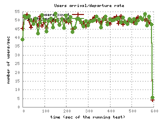
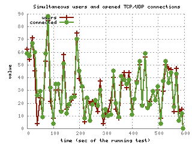
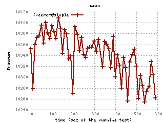
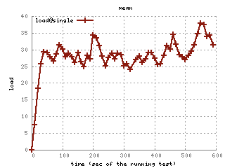

# bbc单机打压部署

### 测试服务器的配置
Dell R610 8cpu 16G radis10 300G

### 软件版本
PHP Version 5.4.40 ,mysql 5.6 ,nginx 1.7.7.1 ,apc 3.1.13 ,memcache 2.2.7 

### 数据量
goods 10000 member 4000 order 28800 

### 打机时间
600s

### 模拟负载
order 1% ,index 59% ,item 20% ,shopeindex 10% ,search 10% 

### 打压步骤
```
1：配置好php环境
2：安装php扩展apc
3：修改bbc的源码使其跳过验证码 
	/data/www/b2b2c/app/base/lib/vcode.php
	查找app/base/lib/下vcode.php 修改59行，return false修改为true
4:修改bbc源码 /data/www/b2b2c/app/topc/controller/trade.php 注视43到48行。即以下代码
$md5CartInfo = md5(serialize(utils::array_ksort_recursive($cartInfo, SORT_STRING)));
        if( $postData['md5_cart_info'] != $md5CartInfo )
        {
            $msg = app::get('topc')->_("购物车数据发生变化，请刷新后确认提交");
            return $this->splash('false', '', $msg, true);
        }

5：修改bbc源码 /data/www/b2b2c/app/systrade/lib/data/trade/create.php 注释 57行 。即以下代码
$delCartResult = app::get('systrade')->rpcCall('trade.cart.delete', array('cart_id'=>$cartIds,'mode'=>$sdf['mode'],'user_id'=>$sdf['user_id']), 'buyer');

添加：$delCartResult = true;

6:把config下面的catch.php，log.php  app.php  都cope到config下面的production目录下面。修改catch.php  把enabled 的值改成true。修改app.php 把debug 的值改成false 。修改log.php把record_level 的值改成info


7:修改：/b2b2c/app/systrade/lib/data/trade/create.php  
	94行： $tid = date('ymdHim').rand(0,9999);
	157行：$oid = date('ymdHim').rand(0,9999);

8：分4个阶段压测  找到基准点
       阶段    持续时间     每秒增加用户数
   	一：     600s          30/s    
        二：     600s          40/s
        三：     600s          50/s
        四：     600s          55/s
9：找到基准点为 600s  50/s  进行基准压力测试  完成.
```

### 打压结果


Transactions and Pages

Requests and connection establishment

Transactions

Requests

Network traffic

New Users

Simultaneous Users

CPU%

Free Memory

CPU Load



