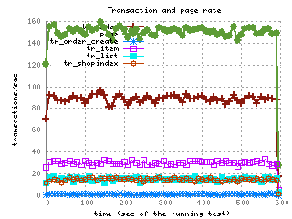
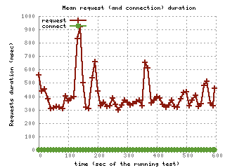
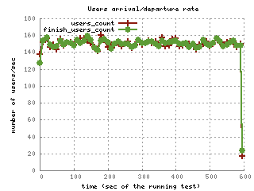
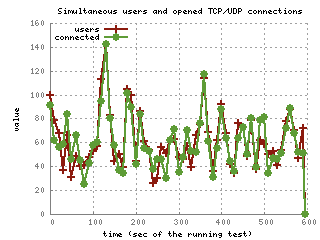
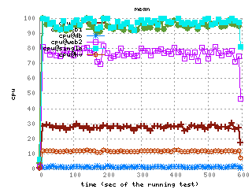
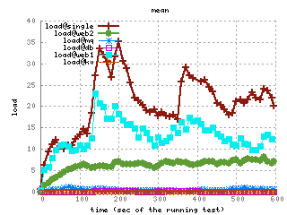

# bbc多机打压部署

### 数据量
goods 10000 member 4000 order 120000 

### 打机时间
60s

### 模拟负载
order 1% ,index 59% ,item 20% ,shopeindex 10% ,search 10% 

### 服务器配置
3台web机  2台mysql 一台redis 一台打压机

### 打压步骤

```
1：web机 ：51 52 58 都是8核  16g 每台都添加php加速器APC3.1.13 memcached2.2.6缓存
2：redis memcached：56
3：打压机：57
4：mysql5.6主：54
5：mysql5.6从：55
6：负载均衡器在51 上面。
7：代码修改处：
	（1）修改bbc的源码使其跳过验证码 
	/data/www/b2b2c/app/base/lib/vcode.php
	查找app/base/lib/下vcode.php 修改59行，return false修改为true
	（2）:修改bbc源码 /data/www/b2b2c/app/topc/controller/trade.php 注视43到48行。即以下代码
$md5CartInfo = md5(serialize(utils::array_ksort_recursive($cartInfo, SORT_STRING)));
        if( $postData['md5_cart_info'] != $md5CartInfo )
        {
            $msg = app::get('topc')->_("购物车数据发生变化，请刷新后确认提交");
            return $this->splash('false', '', $msg, true);
        }

	（3）：修改bbc源码 /data/www/b2b2c/app/systrade/lib/data/trade/create.php 注释 57行 。即以下代码
$delCartResult = app::get('systrade')->rpcCall('trade.cart.delete', array('cart_id'=>$cartIds,'mode'=>$sdf['mode'],'user_id'=>$sdf['user_id']), 'buyer');

添加：$delCartResult = true;

	（4）:把config下面的catch.php，log.php  app.php kvstore.php  都cope到config下面的production目录下面。
		修改catch.php  把enabled 的值改成true。默认缓存处理 修改成 'default' => 'base_cache_memcached', 最低下memcached配置修改成： 
		'base_cache_memcached' => array(
			'hosts' => array(
			    '192.168.10.56:11211',
			)
		    ),//memcached配置

		修改app.php 把debug 的值改成false 。
		修改log.php把record_level 的值改成info
		修改kvstore.php 默认缓存处理类修改成：'default' => 'base_kvstore_redis',最下面一行redis配置：'base_kvstore_redis' => '192.168.10.56:6379',
		修改database.php 将default修改成
		'default' => array(
		   /* 'driver'    => 'mysqli',
		    'host'      => '192.168.10.55:3307',
		    'dbname'  => 'b2b2c',
		    'user'  => 'bbc',
		    'password'  => 'test',
		    'charset'   => 'utf8',*/
		    //'collation' => 'utf8_general_ci',
		    'master' => array('user' => 'bbc', 'password' => 'test', 'host' => '192.168.10.54:3307', 'dbname' => 'b2b2c','charset'   => 'utf8'),
		    'slaves' => array(
		        array('user' => 'bbc', 'password'=>'test', 'host' => '192.168.10.55:3307', 'dbname' => 'b2b2c','charset'   => 'utf8'),
		     ),
		    'driver'    => 'mysqli',
		),//mysql主从配置


	（5）:修改：/b2b2c/app/systrade/lib/data/trade/create.php  
	94行： $tid = date('ymdHim').rand(0,9999);
	157行：$oid = date('ymdHim').rand(0,9999);
	（6）：

8：分4个阶段压测  找到基准点
       阶段    持续时间     每秒增加用户数
   	一：     600s          100/s    
        二：     600s          150/s
        三：     600s          180/s
        四：     600s          200/s
9：找到基准点为 600s  150/s  进行基准压力测试  完成。
```

### 打压结果




Transactions and Pages

Requests and connection establishment

Transactions

Requests

Network traffic

New Users

Simultaneous Users

CPU%

Free Memory

CPU Load

