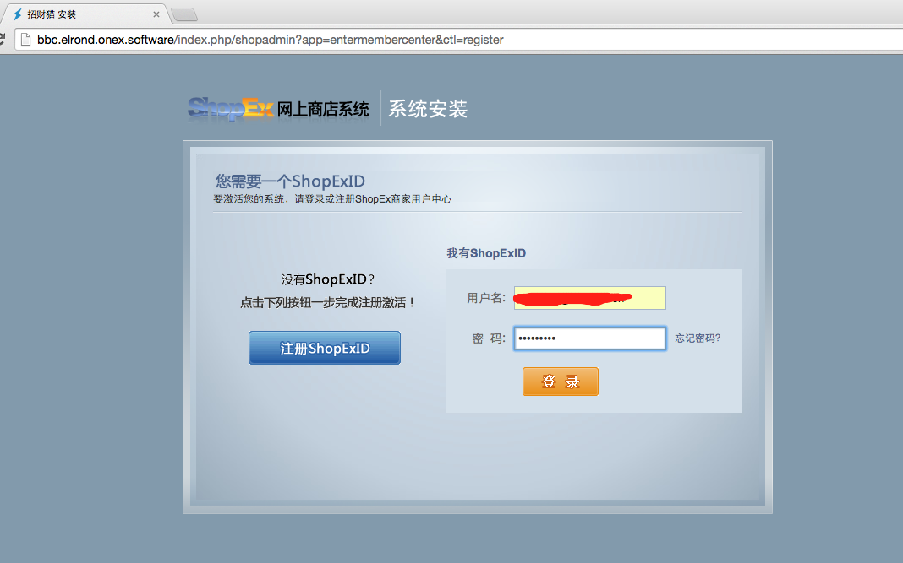
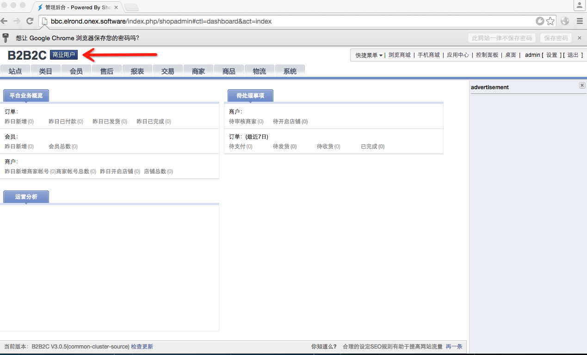

# 安装 ONex B2b2c

## 激活 ONex B2b2c

### 登陆ShopEx ID

- 第一次打开后台时，需要登陆ShopEx ID，系统会自动跳转到登陆页

### 注册Shopex ID

- 如果没有ShopEx ID, 请点击“注册ShopExID”，根据提示注册。

### 完成ShopEx ID 登陆

- 输入ShopEx ID登陆以后，可以看到如下页面，表示验证通过。

### 输入激活码

- 完成ShopEx ID登陆后，会自动跳转到激活码激活页面。

### 提交激活码

- 输入激活码后，点击“提交”，会自动跳转到后台登陆页面

### 完成激活

- 输入安装时设置的用户名和密码，就可以登陆后台。
- 左上角有激活的版权信息。

