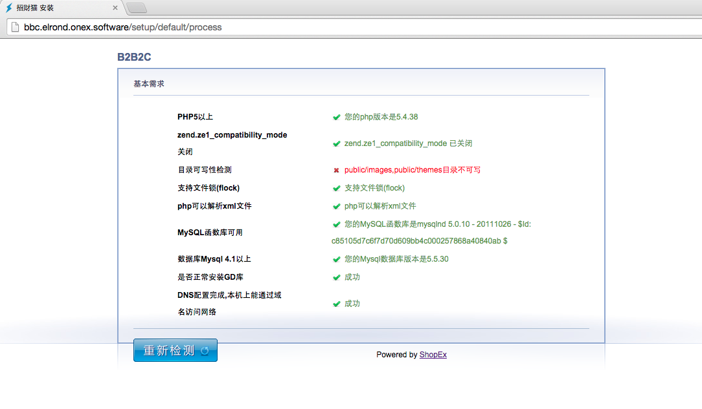
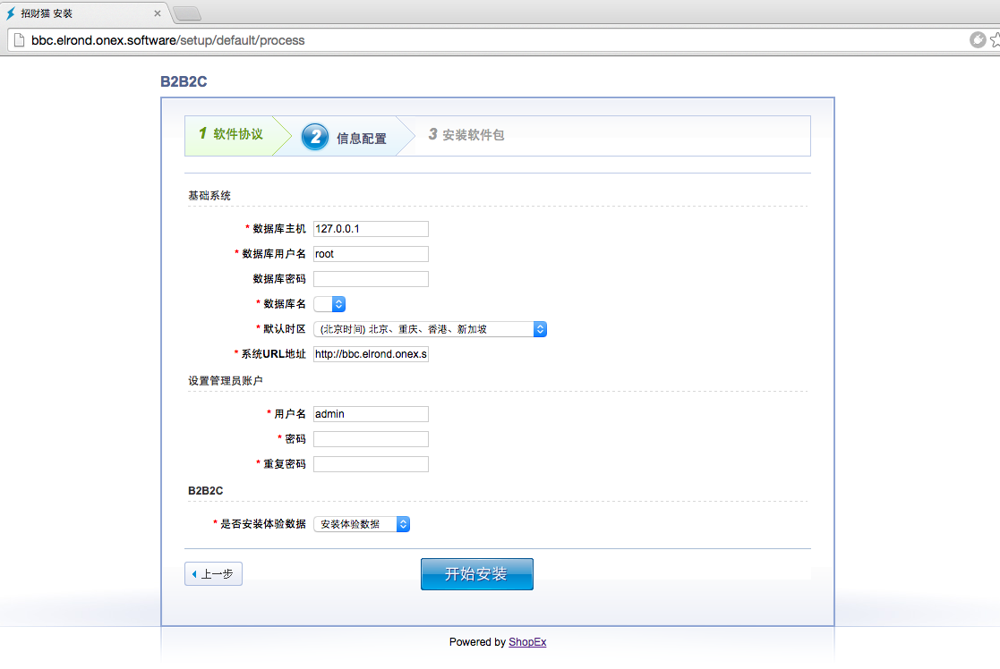

# 安装 ONex B2b2c

## 安装系统

### 开始安装

- 部署完成后，打开浏览器，登陆域名，会直接跳转到setup安装页面。点击“开始安装”。


### 环境监测

- 系统会自动监测当前环境，如果有不符合环境需求的，会自动跳转到测试页面。
- 如果环境符合系统需求，则会跳过这个页面。
- 排除错误后，刷新该页面即可。



### 软件协议

- 阅读并同意协议内容后，点击“同意协议进入下一步”。


### 安装设置配置

- 配置数据库、时区相关信息。
- 配置系统URL地址，用于在命令行下生成url。
- 配置安装完成后的```运营商后台```用户名和密码
- 选择是否需要安装demo数据。




### 安装

- 等待系统自动安装即可。


### 安装完成

- 自动安装完成后，自动跳转到完成页。
- 可以进入后台进行激活流程。


